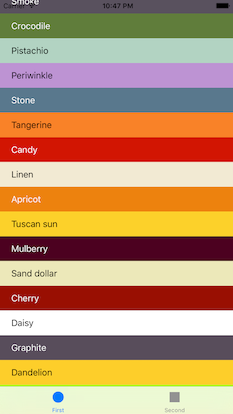

# WaddaColor

Swift library for a naming a color, based on a closest match to the colors in
Ingrid Sundbergs [Color Thesaurus](http://ingridsundberg.com/2014/02/04/the-color-thesaurus/).

Just give it any color and it will return the name of that color, and what a color it is.

## Usage

Via the UIColor extention:

	UIColor.blackColor().name // Black

or via a `WaddaColor` instance:

    let wadda = WaddaColor(color: UIColor.orange())
    let match = wadda.closestMatch()
    return match.name // Tangerine

## Example app

The Xcode project contains a sample app target called WhatTheColor

## Author

WaddaColor was made by [Johan Sørensen](http://johansorensen.com)

## Credits

Ingrid Sundberg named all the colors in her [Color Thesaurus](http://ingridsundberg.com/2014/02/04/the-color-thesaurus/) post. Amazing.

## License

MIT, see LICENSE

